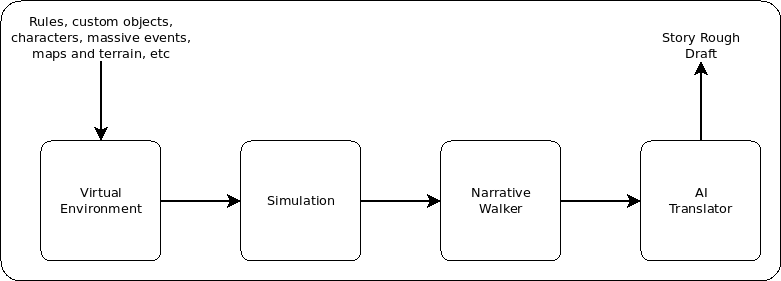

## What is Narrative Hack?

Narrative Hack is an engine for procedurally generating detailed, controllable, stories based on provided rules within a given environment. The generated stories are meant to serve as a base that can be built upon in a meaningful way or aid as a method of "filling in the blanks" for a given story. As long as the rules for a given environment are provided, the engine can continue forward, making decisions and guiding the path of the story, keeping note of the fine details that might be glanced over in standard writing.

Narrative Hack is designed as a writing helper for creating the foundation of a storyline, rather than a finished product. It's aimed for helping overcome problems like writers block, ensuring consistency, or simply helping the writer be just as surprised with the outcome of a book as the reader would be.

## How does it work?

In Narrative Hack, the rough draft for the storyline is generated procedurally. This is done by putting together a set of environment rules, custom objects and characters, personalities, and maps or map generators, overall story progression, etc, into a virtual environment. This virtual environment will then run a simulation based on the provided information and document any noteworthy events.

After writing a detailed documentation of all potentially relevant events, the Narrative Walker algorithm will then march over the event documentation and piece it together into a narrative of events and information following the protagonist or other entities that require attention. This is when the basic story itself begins to take form. Albeit, in very monotone "console speak".

Lastly, this monotone story draft is then passed through an AI translator to add some life and flavor to the story and make it feel more like a book than a computer-generated document. The output of this step should be our first real rough draft of the story.

